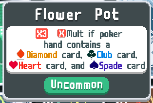

# Icons
### A mod made by Breuhh, Jogla and Aura2247

Icons introduces small images that are placed next to text in descriptions of cards. Like how when they mention Characters in Super Mario games. 

# API Documentation: Icons.Icon
* **Required Parameters**:
  * `key`
* **Optional Parameters** *(defaults)*:
  * `atlas = "Joker", pos = {x = 0, y = 0}`
  * `targets = {self.key}`
    * `targets` is what text it should search for when adding an icon
    * Must be a table
